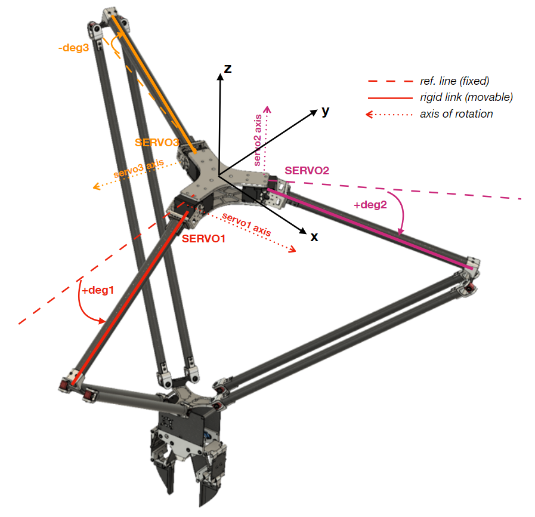
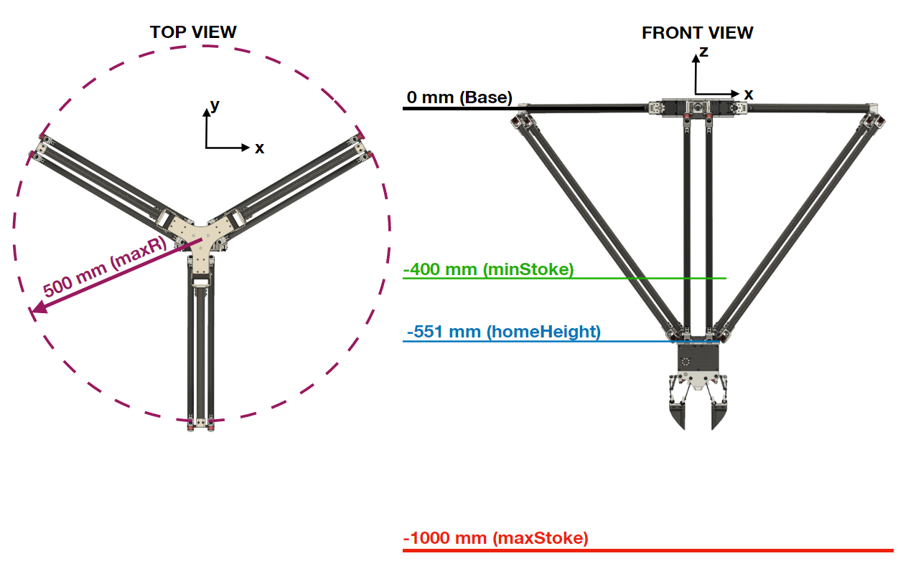
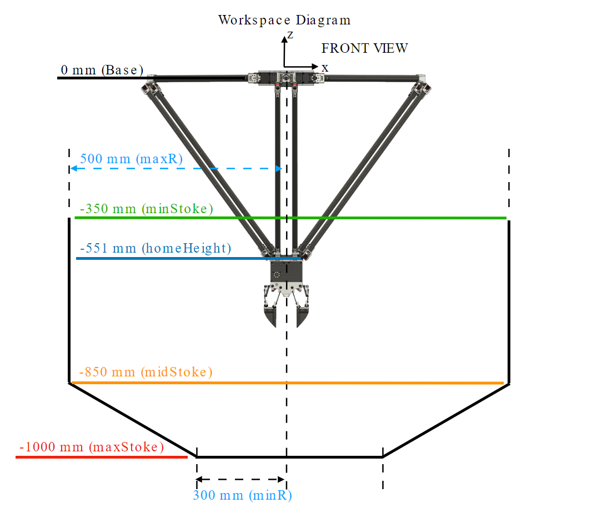
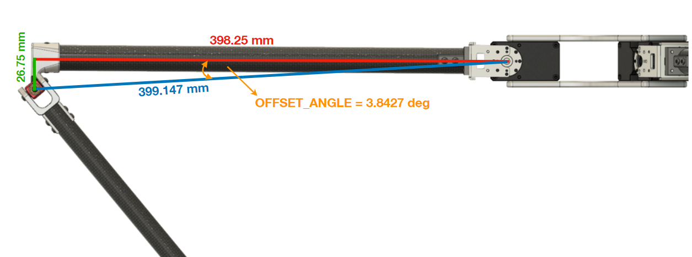

# The-Delta-Robot-MK2-Cpp
This project is developed from the first version of Delta Robot (No repository). The robot was upgraded as following...
1. Working range is expanded to 500mm max radius with max stoke of 600mm
2. The stiffness of the distal link is inceased due to none of ball joints are used. A custom designed of universal joints are used instead.
3. Drive unit is changed to XM540-W270-R instead of MX106-R Dynamixel for the reason of cost and performance.
4. The code is developed on c++, so it can run faster than the previous Python version. And has a possibilty to integrate with other platform like OpenKAI.
5. New gripper system, a two-fingers gripper
The actual robot with gripper are shown here.


The purpose of developing this robot is to integrate with AI system, UGV or even fixed ground, to pick-and-place multi object such as garbage on the beach, vegetables in the farm, planting, sorting, etc. 

# Hardware you may need...
1. The Delta robot MK2
2. U2D2 (Dynamixel USB to RS485 converter)
3. Battery 3s to 4s LiPo
4. Computer (Jetson Nano is used here)

# Code
First of all, the code is developed on Jetson Nano (Ubuntu) with C++ language. Many functions in this class are developed from [https://github.com/BenbenIO/LabArm-Cpp-API] , but for the Delta Robot MK2 Cpp, all of the source file (robot class and servo class) are combined into one file as DeltaRobotClass.cpp . The code is based on Dynamixel SDK C++ version, so if you haven't installed the Dynamixel SDK source file into your computer please check this [repo](https://github.com/ROBOTIS-GIT/DynamixelSDK) for more information. And if you are using Linux base, just follow this [YouTube](https://www.youtube.com/watch?v=zb8I05D-LGE) link.

## Example
From exampleDeltaRobot.cpp, in the main loop, the first part is to create an object of class as DRC. You need to do the `RobotInit(3)` everytime you start the robot for initialization.
```
//Create an object of Delta Robot Class as DRC
DeltaRobotClass DRC;

//Initialize the robot and passing 3 as operation mode (Position control) as default
DRC.RobotInit(3);

//
DRC.RobotTorqueON();
DRC.GripperTorqueON();
usleep(1000000);
DRC.GripperCheck();
usleep(1000000);

DRC.GoHome();
usleep(2000000);
```
After that you may need to turn the torque of the robot and gripper ON by calling `RobotTorqueON()` and `GripperTorqueON`.
Normally, the robot should start from home position before operating something, so let move the robot from anywhere to home position by calling `GoHome()`. A home position for this robot was set as 180deg for each servo, you can check the detail in DeltaRobotClass.cpp file. 

This robot is using SyncRead and SyncWrite from Dynamixel SDK for position address, so it can perform the read/write data super fast compare to normal read/write single servo 3 times.
```
float RobotAng[3];
DRC.GetRobotAngle(RobotAng);
```
This function will read the angle of the robot kinematics, for example, from following image...



From above image, the `RobotAng[3]` that will get from `GetRobotAngle()` function is (+deg1,+deg2,-deg3). The dashed line in the image is a reference line that always horizontal fixed, and with the right-hand rule around the axis of rotation, the rigid link (straight line) will make the angle from ref. line as (+deg1,+deg2,-deg3). So when rigid link and ref. line become colinear or parallel to the ground, deg1, deg2 and deg3 will be 0. But for the servo configuration, those will be 180deg. For the simply explain, when you call the `GetRobotAngle(RobotAng)`, you will get the angle in kinematics point of view.  

```
float XYZ[3];
DRC.GetXYZ(XYZ);
```
`GetXYZ()` is something like `GetRobotAngle` but you will get the cartesian coordinate `XYZ[3]` of the robot instead of `RobotAngle[3]`. So inside the function, it used `FWD(robotAngle,currentXYZ)` to convert the robotAngle to currentXYZ.

```
DRC.GotoPoint(200,-200,-800);
```
`GotoPoint(X,Y,Z)` is a command to move the robot to desired point `X,Y,Z`, REMEMBER, `Z` is always be negative because of the reference coordinate of Z is pointing up and the base plate is considered as 0, so lower than the plate will be minus value as shown on the robot kinematics. The horizontal planar range of xy plane is defined from this workspace image.



The robot can go around in the circle of maxR = 500, you shouldn't change this value because this is the mechanical constraint of this robot. You can change the `minStoke` and `maxStoke` in DeltaRobotClass.h according to your application to prevent the robot to go over your limit.
For example, I tested the robot and found that there is some point that the robot cannot go in mathematically, which means given that point the inverse kinematics cannot calculate due to it really close to singularity posture, so I made the new working space as following picture 



and add some constraint at `XYZOutRange(X,Y,Z)` function to detect strange value of XYZ input from user. At that function...
```
int DeltaRobotClass::XYZOutRange(float X, float Y, float Z)
{
	int WarningFlag = 0;
	float workingR;
	float maxZ;

	workingR = sqrt(pow(X,2) + pow(Y,2));
	
	maxZ = 0.75*workingR - 1225.0;

	if ( (workingR > maxR) || (Z < maxStoke) || (Z < maxZ) || (Z > minStoke) )
	{
		WarningFlag = 1;
		printf("XYZOutRange: input value is invalid, try change X, Y or Z \n");
	}
	else
	{
		WarningFlag = 0;
	}

	return WarningFlag;
}
```
First you can see that, the function brings X,Y to calculate the working radius of desired point as `workingR`, after that according to your `workingR`, the maximum Z value that the robot can go is calculated as `maxZ = 0.75*workingR - 1225.0;`. This linear function is from the slope line at the bottom part of working space, so it means if your input Z is upper than that line, the robot can move.

If the speed is too fast or too slow, you can change the value in `DEFAULT_TIMEACC` and `DEFAULT_TIMESPAN` which are a profile generation values. I always set `DEFAULT_TIMEACC` around half of the `DEFAULT_TIMESPAN` or a bit lower, to make robot moves smoothly.

At the end of script, you will see this comment while loop
```
while(1){

	DRC.KinematicsCheck();
}
```
This is for debugging to check the robot position XYZ and robot angle. `KinematicsCheck()` will calle the `GetRobotAngle()` , `FWD()`, `INV()` to see whether the curreny XYZ is collect or not with actual measurement, or even there is some miscalculation from forward and inverse kinematics or not. You may see that it has 
```
GetRobotAngle(RobotAngle);
printf("RobotAngle J1: %f \n", RobotAngle[0]);
printf("RobotAngle J2: %f \n", RobotAngle[1]);
printf("RobotAngle J3: %f \n", RobotAngle[2]);
printf("-----------------------------------\n");

RobotAngleWithOffset[0] = RobotAngle[0]+3.8427;
RobotAngleWithOffset[1] = RobotAngle[1]+3.8427;
RobotAngleWithOffset[2] = RobotAngle[2]+3.8427;

printf("RobotAngleWithOffset J1: %f \n", (RobotAngle[0]+3.8427));
printf("RobotAngleWithOffset J2: %f \n", (RobotAngle[1]+3.8427));
printf("RobotAngleWithOffset J3: %f \n", (RobotAngle[2]+3.8427));
printf("-----------------------------------\n");
```
what is RobotAngleWithOffset? Why WithOffset and no offset??...
So let me explain, when you do `GetRobotAngle(RobotAngle)`, it does the SyncRead position data of the servo, after remove the servo configuration angle (180deg), the output is robot angle in kinematics diagram... But the new Delta Robot MK2 has a joint offset between proximal (short) and distal (long) links, which shown in this image...



You can see that the actual length of proximal link is 398.25mm (red), and there is a small offset 26.75mm (green) before connecting to the distal link. So this give us a right angle, and the artificial length is 399.147mm (blue). When we construct the kinematics diagram, we always use this artificial length (blue line), so if you want to do the forward or inverse kinematics, you have to take that `OFFSET_ANGLE` into account. I already added this `OFFSET_ANGLE` in the `FWD()` and `INV()`, so don't worry about this. Just keep in mind.
For the inverse and forward kinematics of the delta robot, I suggest you to download the paper of "The Delta Parallel Robot: Kinematics Solutions" from Robert L. Williams II., which explain everything perfectly about the delta robot. You may see that the kinematics in the paper and mine are a bit different at the joint I noticed, so that's why I need to add some offset for my case. The reason I designed the offset because the robot can go more in sharp angle which lead to more working space.

That's it for the example, so you can try to apply this to your work by using my example as a guideline.
