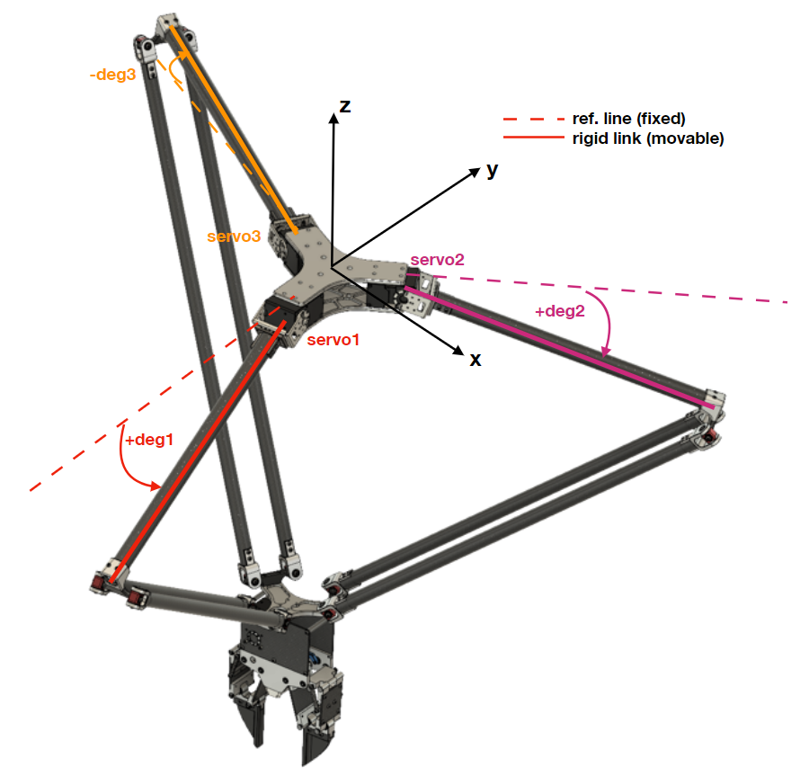

# The-Delta-Robot-MK2-Cpp
This project is developed from the first version of Delta Robot (No repository). The robot was upgraded as following...
1. Working range is expanded to 500mm max radius with max stoke of 600mm
2. The stiffness of the distal link is inceased due to none of ball joints are used. A custom designed of universal joints are used instead.
3. Drive unit is changed to XM540-W270-R instead of MX106-R Dynamixel for the reason of cost and performance.
4. The code is developed on c++, so it can run faster than the previous Python version. And has a possibilty to integrate with other platform like OpenKAI.
5. New gripper system, a two-fingers gripper
The actual robot with gripper are shown here.


The purpose of developing this robot is to integrate with AI system, UGV or even fixed ground, to pick-and-place multi object such as garbage on the beach, vegetables in the farm, planting, sorting, etc. 

# Hardware you may need...
1. The Delta robot MK2
2. U2D2 (Dynamixel USB to RS485 converter)
3. Battery 3s to 4s LiPo
4. Computer (Jetson Nano is used here)

# Code
First of all, the code is developed on Jetson Nano (Ubuntu) with C++ language. Many functions in this class are developed from [https://github.com/BenbenIO/LabArm-Cpp-API] , but for the Delta Robot MK2 Cpp, all of the source file (robot class and servo class) are combined into one file as DeltaRobotClass.cpp . The code is based on Dynamixel SDK C++ version, so if you haven't installed the Dynamixel SDK source file into your computer please check this [repo](https://github.com/ROBOTIS-GIT/DynamixelSDK) for more information. And if you are using Linux base, just follow this [YouTube](https://www.youtube.com/watch?v=zb8I05D-LGE) link.

## Example
From exampleDeltaRobot.cpp, in the main loop, the first part is to create an object of class as DRC. You need to do the `RobotInit(3)` everytime you start the robot for initialization.
```
	//Create an object of Delta Robot Class as DRC
	DeltaRobotClass DRC;

	//Initialize the robot and passing 3 as operation mode (Position control) as default
	DRC.RobotInit(3);

	//
	DRC.RobotTorqueON();
	DRC.GripperTorqueON();
	usleep(1000000);
	DRC.GripperCheck();
	usleep(1000000);

	DRC.GoHome();
	usleep(2000000);
```
After that you may need to turn the torque of the robot and gripper ON by calling `RobotTorqueON()` and `GripperTorqueON`.
Normally, the robot should start from home position before operating something, so let move the robot from anywhere to home position by calling `GoHome()`. A home position for this robot was set as 180deg for each servo, you can check the detail in DeltaRobotClass.cpp file. 

This robot is using SyncRead and SyncWrite from Dynamixel SDK for position address, so it can perform the read/write data super fast compare to normal read/write single servo 3 times.
```
	float RobotAng[3];
	DRC.GetRobotAngle(RobotAng);
```
This function will read the angle of the robot kinematics, for example, from following image...



From above image, the `RobotAng[3]` that will get from `GetRobotAngle()` function is (+deg1,+deg2,-deg3). The dashed line in the image is a reference line that always horizontal fixed
  
